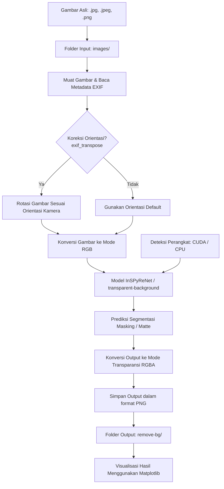

# 🖼️ Remove Background Apps

[](https://colab.research.google.com/github/alfitranurr/Remove-Background-Apps/blob/main/Remove_Background_Apps.ipynb)
[](https://www.python.org/)
[](https://pytorch.org/)
[](LICENSE)
[](https://github.com/alfitranurr/Remove-Background-Apps)

**Remove Background Apps** adalah sebuah aplikasi berbasis Jupyter Notebook/Python yang dirancang untuk menghapus latar belakang (background) gambar secara otomatis dan massal (batch processing) dengan akurasi tinggi. Aplikasi ini memanfaatkan pustaka deep learning **`transparent-background`** yang didukung oleh model segmentasi mutakhir (InSPyReNet) berbasis **PyTorch**. Proyek ini dioptimalkan baik untuk berjalan secara lokal maupun di lingkungan cloud seperti **Google Colab** dengan dukungan akselerasi GPU (CUDA).

---

## 📌 Daftar Isi
- [🖼️ Remove Background Apps](#️-remove-background-apps)
  - [📌 Daftar Isi](#-daftar-isi)
  - [📖 Pengenalan Project](#-pengenalan-project)
    - [Mengapa Memilih Proyek Ini?](#mengapa-memilih-proyek-ini)
    - [Teknologi yang Digunakan](#teknologi-yang-digunakan)
  - [🏗️ Arsitektur Proyek](#️-arsitektur-proyek)
    - [Diagram Arsitektur Sistem](#diagram-arsitektur-sistem)
    - [Spesifikasi Model](#spesifikasi-model)
  - [🔄 Workflow (Alur Kerja)](#-workflow-alur-kerja)
  - [📁 Struktur Direktori](#-struktur-direktori)
  - [🚀 Instalasi & Penggunaan](#-instalasi--penggunaan)
    - [A. Berjalan di Google Colab (Rekomendasi / Mudah)](#a-berjalan-di-google-colab-rekomendasi--mudah)
    - [B. Berjalan di Komputer Lokal (Local Setup)](#b-berjalan-di-komputer-lokal-local-setup)
      - [1. Prasyarat Sistem](#1-prasyarat-sistem)
      - [2. Langkah Setup](#2-langkah-setup)
      - [3. Menjalankan Kode](#3-menjalankan-kode)
  - [📸 Contoh Perbandingan (Sebelum \& Sesudah)](#-contoh-perbandingan-sebelum--sesudah)
  - [👤 Developer Profile](#-developer-profile)
  - [📄 Lisensi](#-lisensi)

---

## 📖 Pengenalan Project

Penghapusan latar belakang gambar merupakan kebutuhan penting di berbagai bidang, mulai dari desain grafis, e-commerce, hingga penyiapan dataset untuk model Machine Learning. Melakukan pemotongan background secara manual membutuhkan waktu yang lama dan keahlian khusus. 

Proyek **Remove Background Apps** hadir untuk menyelesaikan masalah tersebut dengan menyediakan sistem pemrosesan otomatis berbasis AI. Cukup dengan menaruh gambar di folder input, aplikasi akan menghasilkan gambar berformat PNG transparan (RGBA) secara instan tanpa mengurangi resolusi asli gambar tersebut.

### Mengapa Memilih Proyek Ini?
* **Akurasi Tinggi**: Menggunakan model segmentasi berbasis InSPyReNet yang mampu memisahkan objek halus seperti helai rambut atau bayangan dari latar belakang dengan sangat rapi.
* **Batch Processing**: Mampu memproses puluhan hingga ratusan gambar sekaligus secara otomatis.
* **Auto-Correction Rotasi**: Dilengkapi dengan penanganan *EXIF Transpose* dari pustaka Pillow untuk memastikan gambar yang diambil dari kamera ponsel tidak terbalik setelah diproses.
* **Fleksibel & Cepat**: Mendukung akselerasi GPU Nvidia (CUDA) untuk pemrosesan super cepat (~2-3 detik per gambar) serta fallback otomatis ke CPU jika GPU tidak tersedia.

### Teknologi yang Digunakan
* **Bahasa Pemrograman**: [Python 3.12](https://www.python.org/)
* **Deep Learning Framework**: [PyTorch](https://pytorch.org/) & [Torchvision](https://pytorch.org/vision/stable/index.html)
* **Core Background Remover**: [transparent-background](https://github.com/xuebinqin/DIS) (InSPyReNet base mode)
* **Image Processing**: [Pillow (PIL)](https://python-pillow.org/) & [OpenCV](https://opencv.org/)
* **Visualisasi**: [Matplotlib](https://matplotlib.org/) (untuk plotting perbandingan hasil)
* **Progress Monitoring**: [tqdm](https://github.com/tqdm/tqdm) (progress bar interaktif)

---

## 🏗️ Arsitektur Proyek

Aplikasi ini menggunakan desain pipa pemrosesan data (Data Pipeline) yang terstruktur dan modular. Alur data dari berkas gambar mentah hingga menjadi gambar transparan dapat digambarkan sebagai berikut:

### Diagram Arsitektur Sistem



### Spesifikasi Model
Model default yang diinisialisasi oleh pustaka `transparent-background` adalah model **`base`** (InSPyReNet) yang dilatih secara khusus untuk mendeteksi subjek utama dalam sebuah gambar (seperti manusia, hewan, kendaraan, atau benda) dan memisahkannya dari latar belakang secara dinamis.

* **Mode Pemrosesan**: `rgba` (Menghasilkan output berformat RGBA dengan channel transparansi).
* **Perangkat**: Otomatis mendeteksi kartu grafis Nvidia dengan CUDA, atau menggunakan CPU sebagai alternatif.

---

## 🔄 Workflow (Alur Kerja)

Langkah-langkah terperinci yang dijalankan di dalam file [Remove_Background_Apps.ipynb](file:///d:/AL%20FITRA/GITHUB/Remove-Background-Apps/Remove_Background_Apps.ipynb) adalah:

1. **Instalasi Dependensi (`!pip install transparent-background`)**
   Sistem mengunduh dan memasang paket utama beserta dependensi prasyaratnya (seperti `timm`, `kornia`, `albumentations`, `pymatting`, dll).
2. **Impor Pustaka & Verifikasi GPU**
   Memuat pustaka Python yang diperlukan dan menjalankan fungsi `torch.cuda.is_available()` untuk memastikan apakah komputasi akselerasi GPU aktif atau tidak.
3. **Konfigurasi Folder Kerja**
   Membuat folder input (`images`) dan output (`remove-bg`) secara otomatis di direktori kerja saat ini menggunakan modul `os.makedirs()`.
4. **Inisialisasi Remover Model (`remover = Remover()`)**
   Memuat arsitektur model dan mengunduh bobot (weight) model terlatih dari repositori server jika dijalankan pertama kali.
5. **Pengunggahan Gambar (Upload)**
   Pada Google Colab, widget unggah berkas digunakan untuk mengirim gambar secara interaktif dari mesin lokal pengguna langsung ke dalam folder `images`.
6. **Eksekusi Pemrosesan Batch**
   * Membaca seluruh file dalam direktori `images` yang berakhiran ekstensi `.jpg`, `.jpeg`, atau `.png`.
   * Melakukan rotasi otomatis berdasar sensor orientasi kamera (`ImageOps.exif_transpose`).
   * Melakukan inferensi segmentasi background via `remover.process(img, type='rgba')`.
   * Menyimpan hasilnya ke folder `remove-bg` dengan nama `{nama_file_asli}_transparent.png`.
7. **Pencatatan File Hasil**
   Mencetak daftar file yang telah berhasil diproses di direktori output untuk keperluan verifikasi.
8. **Visualisasi Komparatif**
   Menggunakan `matplotlib.pyplot` untuk memplot dan menampilkan gambar asli secara berdampingan dengan gambar hasil penghapusan background, memberikan visualisasi instan kepada pengguna.

---

## 📁 Struktur Direktori

Berikut adalah struktur dari proyek ini:

```text
Remove-Background-Apps/
├── .git/                          # Folder konfigurasi Git
├── images/                        # Folder tempat menaruh gambar input (Original)
│   ├── Dhani PDH.JPG
│   ├── Meme PDH.JPG
│   └── Riko PDH.JPG
├── remove-bg/                     # Folder tempat menyimpan hasil gambar (Transparent)
│   ├── Dhani PDH_transparent.png
│   ├── Meme PDH_transparent.png
│   └── Riko PDH_transparent.png
├── README.md                      # Dokumentasi lengkap proyek (File ini)
└── Remove_Background_Apps.ipynb   # Main Jupyter Notebook proyek
```

---

## 🚀 Instalasi & Penggunaan

### A. Berjalan di Google Colab (Rekomendasi / Mudah)
Cara termudah untuk mencoba proyek ini tanpa melakukan instalasi lokal adalah melalui Google Colab:
1. Klik badge **Open In Colab** di bagian atas halaman ini.
2. Jalankan cell langkah demi langkah (tekan tombol `Shift + Enter` atau tombol play pada setiap cell).
3. Saat sampai pada cell **Upload Images**, pilih gambar dari komputer Anda.
4. Tunggu hingga proses segmentasi selesai, lalu periksa folder `remove-bg` pada menu file manager sebelah kiri Colab untuk mengunduh hasil gambar PNG transparan Anda.

### B. Berjalan di Komputer Lokal (Local Setup)

Jika Anda ingin menjalankan aplikasi ini di komputer lokal (Windows/Linux/macOS), ikuti petunjuk berikut:

#### 1. Prasyarat Sistem
* **Python**: Python versi 3.8 s.d. 3.12 terinstal di sistem Anda.
* **GPU Nvidia & CUDA Toolkit** (Opsional, agar pemrosesan gambar berjalan sangat cepat).
* **Git** (untuk menduplikasi repositori).

#### 2. Langkah Setup
1. **Clone Repositori**:
   ```bash
   git clone https://github.com/alfitranurr/Remove-Background-Apps.git
   cd Remove-Background-Apps
   ```

2. **Buat Virtual Environment** (Sangat disarankan agar dependensi tidak bentrok dengan library global):
   * Di Windows:
     ```bash
     python -m venv venv
     venv\Scripts\activate
     ```
   * Di Linux/macOS:
     ```bash
     python3 -m venv venv
     source venv/bin/activate
     ```

3. **Instal Dependensi**:
   Instal PyTorch terlebih dahulu sesuai dengan konfigurasi hardware Anda (silakan merujuk ke situs resmi [PyTorch](https://pytorch.org/) untuk perintah instalasi CUDA yang sesuai). 
   Contoh instalasi standar (CPU/GPU default):
   ```bash
   pip install torch torchvision --index-url https://download.pytorch.org/whl/cu118
   pip install transparent-background pillow tqdm matplotlib opencv-python notebook
   ```

#### 3. Menjalankan Kode
Anda dapat membuka notebook melalui Jupyter Notebook:
```bash
jupyter notebook
```
Buka file `Remove_Background_Apps.ipynb`, masukkan gambar yang ingin Anda hilangkan background-nya ke dalam direktori `images`, lalu jalankan seluruh cell di notebook tersebut.

Sebagai alternatif, Anda juga dapat menulis script Python mandiri (`main.py`) dengan logika yang sama:
```python
import os
import torch
from PIL import Image, ImageOps
from tqdm import tqdm
from transparent_background import Remover

# Konfigurasi folder
INPUT_DIR = "images"
OUTPUT_DIR = "remove-bg"
os.makedirs(INPUT_DIR, exist_ok=True)
os.makedirs(OUTPUT_DIR, exist_ok=True)

# Inisialisasi model
print("CUDA tersedia:", torch.cuda.is_available())
remover = Remover()

# Ambil list file
image_files = [f for f in os.listdir(INPUT_DIR) if f.lower().endswith(('.jpg', '.jpeg', '.png'))]

for filename in tqdm(image_files):
    input_path = os.path.join(INPUT_DIR, filename)
    output_path = os.path.join(OUTPUT_DIR, f"{os.path.splitext(filename)[0]}_transparent.png")
    
    img = Image.open(input_path)
    img = ImageOps.exif_transpose(img) # Mengatasi rotasi otomatis kamera
    img = img.convert("RGB")
    
    result = remover.process(img, type='rgba')
    result.save(output_path)

print("Proses penghapusan latar belakang selesai!")
```
Jalankan menggunakan:
```bash
python main.py
```

---

## 📸 Contoh Perbandingan (Sebelum & Sesudah)

Model segmentasi ini membagi setiap piksel gambar menjadi bagian objek utama dan latar belakang. Berikut adalah representasi hasil pemrosesan:

| Gambar Asli (Original) | Hasil Tanpa Background (Transparent PNG) |
| :---: | :---: |
| Dilengkapi latar belakang bertekstur, warna bervariasi, outdoor/indoor | Objek utama terpotong sempurna dengan tepian halus (Anti-Aliasing) dan format latar transparan |

---

## 👤 Developer Profile

Proyek ini dikembangkan dan dipelihara oleh:

* **Nama Lengkap**: Al Fitra Nur Ramadhani
* **Email**: [alfitranurr@gmail.com](mailto:alfitranurr@gmail.com)
* **GitHub**: [@alfitranurr](https://github.com/alfitranurr)
* **Repository Proyek**: [Remove-Background-Apps](https://github.com/alfitranurr/Remove-Background-Apps)

Jika Anda memiliki pertanyaan, saran perbaikan, atau ingin berkontribusi dalam pengembangan aplikasi ini, silakan ajukan *Issue* atau buat *Pull Request* langsung di halaman repositori GitHub.

---

## 📄 Lisensi

Proyek ini dilisensikan di bawah **Lisensi MIT** - lihat file [LICENSE](LICENSE) untuk detail lebih lanjut. (Catatan: Pustaka `transparent-background` dan model pra-latih yang diunduh tunduk pada lisensi masing-masing kreator aslinya).

---
*Dibuat dengan 💻 dan ☕ oleh Al Fitra Nur Ramadhani.*
