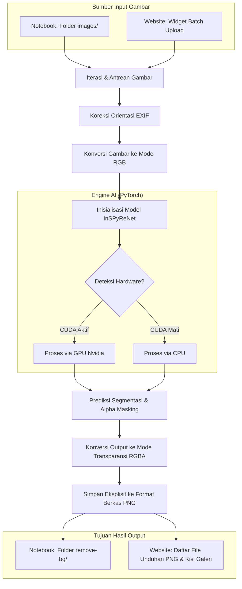

# 🖼️ Batch AI Background Remover

[](https://colab.research.google.com/github/alfitranurr/Remove-Background-Apps/blob/main/Remove_Background_Apps.ipynb)
[](https://huggingface.co/spaces/alfitranurr/remove-background-app)
[](https://www.python.org/)
[](https://pytorch.org/)
[](https://gradio.app/)
[](LICENSE)
[](https://github.com/alfitranurr/Remove-Background-Apps)

📍 **Live Demo Website**: [AI Background Remover on Hugging Face](https://huggingface.co/spaces/alfitranurr/remove-background-app)

**Batch AI Background Remover** adalah sebuah proyek berbasis Python yang dirancang untuk menghapus latar belakang (background) gambar secara otomatis, massal (batch processing), dan presisi tinggi. Aplikasi ini memanfaatkan pustaka deep learning **`transparent-background`** yang didukung oleh model segmentasi mutakhir (**InSPyReNet**) berbasis **PyTorch**. 

Proyek ini hadir dengan dua pilihan penggunaan: **Jupyter Notebook** (sangat cocok untuk komputasi awan seperti Google Colab) dan **Aplikasi Web Interaktif** menggunakan **Gradio** yang dapat dijalankan secara lokal maupun dideploy gratis 100% di **Hugging Face Spaces**.

---

## 📌 Daftar Isi
- [🖼️ Batch AI Background Remover](#️-batch-ai-background-remover)
  - [📌 Daftar Isi](#-daftar-isi)
  - [📖 Pengenalan Project](#-pengenalan-project)
  - [🌟 Fitur Utama](#-fitur-utama)
  - [🏗️ Arsitektur Proyek](#️-arsitektur-proyek)
    - [Diagram Arsitektur Sistem](#diagram-arsitektur-sistem)
    - [Spesifikasi Model & Pipeline](#spesifikasi-model--pipeline)
  - [🔄 Workflow (Alur Kerja)](#-workflow-alur-kerja)
    - [A. Alur Kerja Notebook (Lokal/Colab)](#a-alur-kerja-notebook-lokalcolab)
    - [B. Alur Kerja Web UI (Gradio)](#b-alur-kerja-web-ui-gradio)
  - [📁 Struktur Direktori](#-struktur-direktori)
  - [🚀 Instalasi & Penggunaan](#-instalasi--penggunaan)
    - [A. Berjalan di Google Colab (Mudah & Cepat)](#a-berjalan-di-google-colab-mudah--cepat)
    - [B. Berjalan secara Lokal (Python CLI / Notebook)](#b-berjalan-secara-lokal-python-cli--notebook)
      - [1. Prasyarat Sistem](#1-prasyarat-sistem)
      - [2. Langkah Setup](#2-langkah-setup)
      - [3. Eksekusi Script CLI](#3-eksekusi-script-cli)
    - [C. Menjalankan Website Secara Lokal (Gradio Web UI)](#c-menjalankan-website-secara-lokal-gradio-web-ui)
    - [D. Mendeploy Website ke Cloud Secara Gratis (Hugging Face Spaces)](#d-mendeploy-website-ke-cloud-secara-gratis-hugging-face-spaces)
  - [📸 Contoh Perbandingan (Sebelum \& Sesudah)](#-contoh-perbandingan-sebelum--sesudah)
  - [👤 Developer Profile](#-developer-profile)
  - [📄 Lisensi](#-lisensi)

---

## 📖 Pengenalan Project

Penghapusan latar belakang gambar adalah kebutuhan krusial di berbagai industri seperti *e-commerce*, pemasaran digital, desain grafis, hingga penyiapan dataset untuk Machine Learning. Proses seleksi manual (masking) sangat melelahkan dan memakan waktu lama.

Proyek ini mengatasi masalah tersebut dengan memadukan kecerdasan buatan (AI) segmentasi piksel dengan antarmuka yang ramah pengguna. Cukup masukkan file gambar Anda (satu atau banyak sekaligus), dan AI akan mendeteksi objek utama, memisahkan latar belakang, serta menghasilkan berkas gambar **PNG transparan asli (RGBA)** beresolusi penuh secara instan.

---

## 🌟 Fitur Utama

* **Hapus Background Massal (Batch Processing)**: Unggah puluhan berkas gambar sekaligus, AI akan memprosesnya satu per satu dalam antrean otomatis.
* **Output PNG Asli & Berkualitas**: Gambar disimpan secara eksplisit sebagai berkas `.png` berkualitas tinggi, mencegah konversi otomatis browser ke format `.webp`.
* **Koreksi Rotasi Sensor (EXIF Transpose)**: Menggunakan modul Pillow untuk membaca metadata orientasi kamera ponsel. Gambar potret (*portrait*) atau lanskap (*landscape*) tidak akan terbalik saat diproses.
* **Tampilan Galeri Hasil**: Hasil foto transparan disajikan dalam bentuk kisi galeri yang indah sehingga Anda dapat meninjau semua hasil secara visual sebelum mengunduh.
* **Akselerasi Multi-Hardware**: Mendukung GPU Nvidia (CUDA) untuk performa inferensi super cepat (~1-2 detik per gambar) serta *fallback* otomatis ke CPU jika kartu grafis tidak tersedia.
* **Siap Deploy 100% Gratis**: Dilengkapi berkas konfigurasi Gradio (`app.py` & `requirements.txt`) sehingga siap diunggah ke Hugging Face Spaces tanpa biaya bulanan apa pun.

---

## 🏗️ Arsitektur Proyek

Aplikasi ini dirancang menggunakan arsitektur pipa pemrosesan data (*Data Pipeline*) yang modular. Data dialirkan secara aman melalui tahapan berikut:

### Diagram Arsitektur Sistem



### Spesifikasi Model & Pipeline
* **Model AI**: InSPyReNet (*Interesting Structure Tensor Product-based Representation Network*) base model.
* **Pipeline Output**:
  - Input: `.jpg`, `.jpeg`, `.png` (RGB mode)
  - Intermediary: Tensor image segmenting & Alpha channel blending
  - Output: `.png` (RGBA mode dengan channel transparansi penuh)

---

## 🔄 Workflow (Alur Kerja)

### A. Alur Kerja Notebook (Lokal/Colab)
Proses dalam berkas [Remove_Background_Apps.ipynb](file:///d:/AL%20FITRA/GITHUB/Remove-Background-Apps/Remove_Background_Apps.ipynb):
1. **Instalasi Paket**: Mengunduh pustaka utama `transparent-background` dan komponen pendukung.
2. **Pengecekan CUDA**: Menampilkan jenis kartu grafis yang aktif.
3. **Pembuatan Direktori**: Membuat folder input `images/` dan folder output `remove-bg/`.
4. **Pemuatan Model**: Memuat file bobot model AI ke memori RAM/VRAM.
5. **Pemrosesan Batch**: Melakukan iterasi berkas gambar di folder input, memperbaiki rotasi EXIF, memotong latar belakang, dan menyimpan hasilnya ke folder output.
6. **Visualisasi**: Memplot hasil sebelum dan sesudah secara berdampingan menggunakan `matplotlib.pyplot`.

### B. Alur Kerja Web UI (Gradio)
Proses dalam berkas [app.py](file:///d:/AL%20FITRA/GITHUB/Remove-Background-Apps/app.py):
1. **Upload**: Pengguna mengunggah satu atau beberapa berkas gambar secara bersamaan di antarmuka web.
2. **Batch Processing**: Gambar dikirim sebagai daftar berkas (*list of files*). Script Python membaca letak penyimpanan sementara gambar tersebut di sistem.
3. **AI Inference & PNG Saving**: Objek utama diisolasi, lalu berkas disimpan secara fisik dalam format PNG di dalam folder sementara (*temporary directory*) server.
4. **Output Rendering**: Website menyajikan tautan unduhan masing-masing berkas PNG asli serta memuat gambar ke dalam galeri preview visual.

---

## 📁 Struktur Direktori

Berikut adalah susunan folder dan file pada repositori proyek ini:

```text
Remove-Background-Apps/
├── .git/                          # Folder konfigurasi repositori Git
├── images/                        # Folder gambar asli input (Notebook)
│   ├── Dhani PDH.JPG
│   ├── Meme PDH.JPG
│   └── Riko PDH.JPG
├── remove-bg/                     # Folder hasil gambar transparan (Notebook)
│   ├── Dhani PDH_transparent.png
│   ├── Meme PDH_transparent.png
│   └── Riko PDH_transparent.png
├── app.py                         # Kode antarmuka website (Gradio Web App)
├── requirements.txt               # Daftar pustaka wajib untuk web deployment
├── README.md                      # Dokumentasi lengkap proyek (File ini)
└── Remove_Background_Apps.ipynb   # File Jupyter Notebook utama proyek
```

---

## 🚀 Instalasi & Penggunaan

### A. Berjalan di Google Colab (Mudah & Cepat)
Anda dapat menjalankan proyek ini tanpa perlu menginstal apa pun di komputer Anda menggunakan server GPU Google gratis:
1. Klik tombol **Open In Colab** di bagian paling atas halaman ini.
2. Jalankan cell satu per satu secara berurutan dengan menekan `Shift + Enter`.
3. Pada langkah pengunggahan file, unggah foto-foto Anda.
4. Hasil pemrosesan dapat langsung diunduh dari folder `remove-bg` di sidebar file manager sebelah kiri Colab.

---

### B. Berjalan secara Lokal (Python CLI / Notebook)

#### 1. Prasyarat Sistem
* **Python**: Versi 3.8 hingga 3.12 terinstal di komputer Anda.
* **GPU Nvidia & CUDA Toolkit** (Sangat disarankan untuk kecepatan ekstra, tetapi opsional).
* **Git** (Untuk menduplikasi repositori).

#### 2. Langkah Setup
1. **Clone Repositori**:
   ```bash
   git clone https://github.com/alfitranurr/Remove-Background-Apps.git
   cd Remove-Background-Apps
   ```

2. **Buat Virtual Environment**:
   * Windows:
     ```bash
     python -m venv venv
     venv\Scripts\activate
     ```
   * Linux/macOS:
     ```bash
     python3 -m venv venv
     source venv/bin/activate
     ```

3. **Instal Pustaka Pendukung**:
   Pasang PyTorch terlebih dahulu sesuai instruksi web resmi [PyTorch](https://pytorch.org/). Contoh instalasi standard:
   ```bash
   pip install torch torchvision --index-url https://download.pytorch.org/whl/cu118
   pip install transparent-background pillow tqdm matplotlib opencv-python notebook gradio
   ```

#### 3. Eksekusi Script CLI
Anda juga dapat membuat file script mandiri (misal: `main.py`) menggunakan logika Python CLI untuk memproses gambar lokal di folder `images/`:
```bash
python main.py
```

---

### C. Menjalankan Website Secara Lokal (Gradio Web UI)

Jika Anda ingin menjalankan aplikasi web interaktif di browser komputer Anda sendiri secara lokal:

1. Pastikan dependensi pada langkah sebelumnya sudah terinstal.
2. Jalankan berkas [app.py](file:///d:/AL%20FITRA/GITHUB/Remove-Background-Apps/app.py):
   ```bash
   python app.py
   ```
3. Buka browser Anda dan masuk ke alamat:
   👉 **`http://localhost:7860`**
4. Silakan gunakan antarmuka web untuk mengunggah gambar dan mengunduh hasilnya secara langsung.

---

### D. Mendeploy Website ke Cloud Secara Gratis (Hugging Face Spaces)

Anda dapat mempublikasikan aplikasi ini ke internet secara gratis menggunakan **Hugging Face Spaces**:

1. Buat akun di [Hugging Face](https://huggingface.co/).
2. Buat Space baru: Klik foto profil Anda di kanan atas -> pilih **New Space**.
3. Isi parameter pembuatan Space:
   * **Space name**: `remove-background-app` (atau nama lain)
   * **SDK**: Pilih **Gradio**
   * **Gradio Template**: Pilih **Blank**
   * **Space hardware**: Pilih **CPU Basic (Free - RAM 16GB)**
   * **Visibility**: Pilih **Public**
4. Klik tombol **Create Space**.
5. Pada halaman utama Space Anda, klik tab **Files** -> pilih **Add file** -> **Upload files**.
6. Unggah berkas [app.py](file:///d:/AL%20FITRA/GITHUB/Remove-Background-Apps/app.py) dan [requirements.txt](file:///d:/AL%20FITRA/GITHUB/Remove-Background-Apps/requirements.txt) dari folder proyek lokal Anda.
7. Gulir ke bawah halaman dan klik tombol hijau **Commit changes to main**.
8. Server Hugging Face akan membangun (*build*) aplikasi Anda secara otomatis. Dalam 1-2 menit, status akan berubah menjadi **`Running`** (hijau) dan website Anda siap diakses oleh publik secara online!

---

## 📸 Contoh Perbandingan (Sebelum & Sesudah)

| Gambar Asli (Sebelum) | Gambar Transparan PNG (Sesudah) |
| :---: | :---: |
| Objek utama dengan latar belakang bervariasi (ruangan, luar ruangan, dll.) | Objek terpotong rapi dengan latar belakang transparan sempurna (RGBA). |

---

## 👤 Developer Profile

Proyek ini dikembangkan dan dirawat dengan penuh dedikasi oleh:

* **Nama Lengkap**: Al Fitra Nur Ramadhani
* **Email**: [alfitranurr@gmail.com](mailto:alfitranurr@gmail.com)
* **GitHub**: [@alfitranurr](https://github.com/alfitranurr)
* **Repositori Proyek**: [Remove-Background-Apps](https://github.com/alfitranurr/Remove-Background-Apps)
* **Live Demo Website**: [AI Background Remover di Hugging Face](https://huggingface.co/spaces/alfitranurr/remove-background-app)

Jika Anda menyukai proyek ini, berikan kontribusi Anda dengan mengirimkan *Pull Request* atau ajukan saran di halaman repositori GitHub!

---

## 📄 Lisensi

Proyek ini dilisensikan di bawah **Lisensi MIT** - lihat file [LICENSE](LICENSE) untuk informasi lebih lanjut. (Catatan: Model segmentasi dan pustaka `transparent-background` tunduk pada lisensi pencipta aslinya).

---
*Dibuat dengan penuh 💻 dan ☕ oleh Al Fitra Nur Ramadhani.*
